# colortextpy

<!-- WARNING: THIS FILE WAS AUTOGENERATED! DO NOT EDIT! -->
Colortextpy is a Python package for adding colors and styles to terminal output, allowing you to create more visually appealing and organized command-line applications. The full `colortextpy` documentation is available at  [https://susuky.github.io/colortextpy/](https://susuky.github.io/colortextpy/)


## Install

Tested on python 3.6-3.11, win11, win11 WSL2, Ubuntu

It doesn’t support win32

``` sh
pip install colortextpy
```

## Usage

### [Color printer](https://susuky.github.io/colortextpy/printer.html)

``` python
from colortextpy import Printer, colorprint

Printer.blue_print('blue')
Printer.blue_print('blue', bold=True)

colorprint('default')
colorprint('#ff3567', color='#ff3567')
colorprint('#123456', color=Fore['#123456'])
colorprint(4, color=4)
colorprint(137, color=Fore['137'])
colorprint('(50, 234, 33)', color=(50, 234, 33))
colorprint('(50, 24, 133)', color='(50, 24, 133)')
colorprint('dark_green', color=Fore.dark_green)

colorprint('violet', background='violet', bold=False)
colorprint('violet', background='violet', bold=True)
colorprint('violet', color=Fore.green, background='violet', bold=True)
```

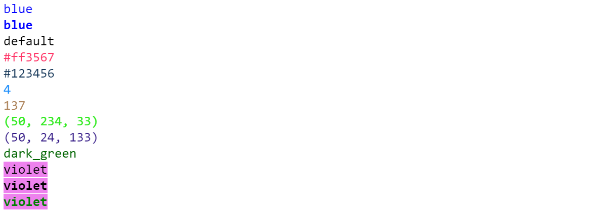

Use `Printer.available` to see other color printers

### [`Fore`](https://susuky.github.io/colortextpy/ansicolor.html#fore), [`Back`](https://susuky.github.io/colortextpy/ansicolor.html#back), [`Style`](https://susuky.github.io/colortextpy/ansicolor.html#style)

``` python
from colortextpy import Fore, Back, Style, AnsiColor, RESET_ALL

Fore, Back, Style
```

    (<AnsiColor: 'FORE'>, <AnsiColor: 'BACK'>, <AnsiColor: 'STYLE'>)

You could use `Style` to get style ansi escape code:

``` python
print(f'{Style["bold"]+Style.underline}bold + underline{Style.end}')
Style['bold'], Style.underline
```

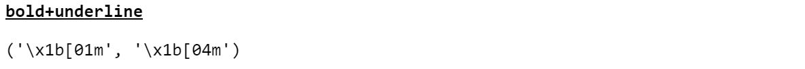

Other style see `Style.availble`, but **bold**, **underline** would be
the most used

You could use `Fore` and `Back` to get the text foreground and
background ansi escape code:

``` python
Fore['red'], Fore.black, Back.chocolate, Back['hotpink']
```

    ('\x1b[38;2;255;0;0m',
     '\x1b[38;2;0;0;0m',
     '\x1b[48;2;210;105;30m',
     '\x1b[48;2;255;105;180m')

Both `Fore` and `Back` could also support **8-bits**, **hex**, **rgb**
color.

``` python
Fore[50], Fore['#ffffff'], Fore['123, 45, 67']
```

    ('\x1b[38;5;50m', '\x1b[38;2;255;255;255m', '\x1b[38;2;123;45;67m')

``` python
Back['144'], Back['#123456'], Back['(55, 244, 31)']
```

    ('\x1b[48;5;144m', '\x1b[48;2;18;52;86m', '\x1b[48;2;55;244;31m')

Here’s demo of supported 8-bits colors:

<details>
<summary>Code</summary>

``` python
for i in range(256):
    end = '\n' if (i+1)%8 == 0 else ' '*2
    print(f'{i:3}: {Back[i]}           {Back.reset}', end=end)
```

</details>

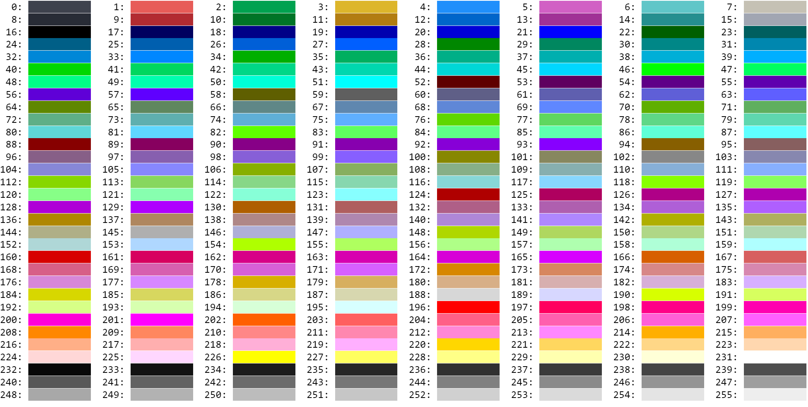

Other available colors are in `Fore.availble` and `Back.available`

You could combine `Fore`, `Back`, `Style` to colorize your output:

``` python
text = 'something123'
print(Fore[50] + text + Fore.reset)
print(Back['black'] + Fore.aliceblue + Style.underline + text)
```

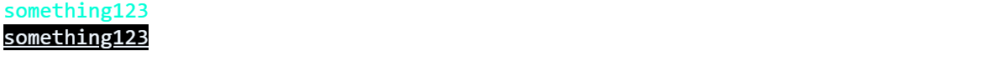

`colortextpy` also provides
[`AnsiColor`](https://susuky.github.io/colortextpy/ansicolor.html#ansicolor-1)
api to combine `Fore`, `Back` and `Style` together.

------------------------------------------------------------------------

### [AnsiColor](https://susuky.github.io/colortextpy/ansicolor.html#ansicolor-1)

>      AnsiColor (fore:str=None, back:str=None, style:str=None)

Integrate with `Fore`, `Back`, `Style`.

|       | **Type** | **Default** | **Details**                                                               |
|-------|----------|-------------|---------------------------------------------------------------------------|
| fore  | str      | None        | Foreground color. Could be hex, rgb string or tuple, `Fore`, 8-bits color |
| back  | str      | None        | Background color, Could be hex, rgb string or tuple, `Back`, 8-bits color |
| style | str      | None        | Text style. Seee `Style.available`.                                       |

``` python
ansi = AnsiColor(fore='#0c0caa', back='aliceblue', style='underline')
print(ansi.ansi_fmt + '123456789' + RESET_ALL)


ansi = AnsiColor(fore=Fore['123, 234, 56'], back=(20, 29, 12), style=('bold', 'underline'))
print(ansi.ansi_fmt + '123' + RESET_ALL)
ansi.fore, ansi.back, ansi.style, ansi.ansi_fmt
```

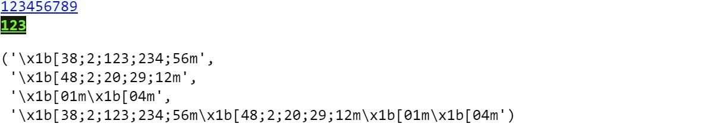

Without setting any color,
[`AnsiColor`](https://susuky.github.io/colortextpy/ansicolor.html#ansicolor-1)
would give emtpy string:

``` python
AnsiColor().ansi_fmt
```

    ''

### [`ColorStream`](https://susuky.github.io/colortextpy/colorizer.html#colorstream)

Enables context managers to work as decorators to colorize the
`sys.stdout` or `sys.stderr`

Some usage:

``` python
    with ColorStream(fore='red'):
        print('text')        

    @ColorStream(fore=Fore.dark_orange)
    def foo():
        print('FOO')
```

``` python
with ColorStream(fore=Fore.dark_violet, autoreset=False):
    print('autoreset off, affect next text')
    with ColorStream(back=Back.light_green, style=(Style.underline, Style.bold)):
        print('add background, underline, bold and autoreset')
        with ColorStream(fore='red'):
            print('Due to autoreset above, It only have red color')
print('Already leave context, show default color')
```

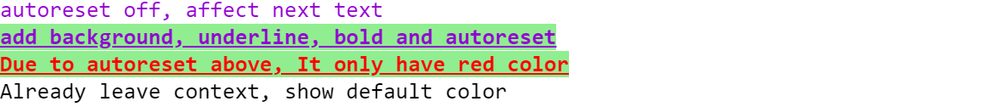

``` python
@ColorStream(fore=Fore.dark_cyan)
def foo():
    print('dark_cyan')
    print('colortextpy')

foo()
```

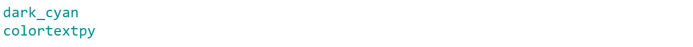

### [`colorize`](https://susuky.github.io/colortextpy/colorizer.html#ansicolorizer)

you can add color tag. Start with \<tag\> end with \</tag\>.

Some usage:

``` python
text = 'something'
text_w_tag = f'{text}-<fg red><bg #f0ffff>{text}</fg></bg>-{text}'
print(colorize(text_w_tag))
```


And some other \<tag\> complex uasge:

<details>
<summary>Code</summary>

``` python
test_strings = ('one', 'two', 'three', 'four', 'five')
test_templates = [
    '{0}',
    '<blue>{0}</fg>',
    '<red>{0}</red>--<bg green>{1}</bg green>',
    '{0}--<red>{1}</red>--<fg red><bg green>{2}</bg>--{3}</fg>',
    '{0}--<50>{1}</fg>--<fg 155><bg 78>{2}</bg></fg>',
    '<bold>{0}--<fg 180, 46, 78>{1}</fg></bold>--<bg 152, 167, 52>{2}</bg>',
    '<underline>{0}--<180, 46, 78>{1}</fg>--<bold>{1}--<bg 152, 167, 52>{2}</underline>--{3}</bold>--{4}</bg>',
    '<bg #59FFAE>{0}--<#AAAA00>{1}--</bg>{2}</fg>--{3}',
]

for template in test_templates:
    print(colorize(template.format(*test_strings)))
```

</details>

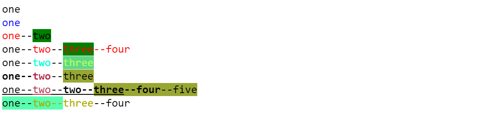

`colorize` also integrates with
[`AnsiColor`](https://susuky.github.io/colortextpy/ansicolor.html#ansicolor-1):

``` python
print(colorize('something1', fore=5, back='#ffeeaa', style='bold'))
print(colorize('something2', fore='r', back='y', style='underline'))
```

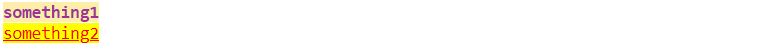

### [`Color`](https://susuky.github.io/colortextpy/color.html#color)

Some Constant of color with **hex**, **rgb**, **bgr** format

``` python
Color.red.name, Color.red.hex, Color.red.rgb, Color['red']
```

    ('red', '#ff0000', (255, 0, 0), <Color.red>)

You could also pass the hex constant from
[`Color`](https://susuky.github.io/colortextpy/color.html#color) into
`matplotlib.pyplot`:

``` python
plt.plot(np.sin(np.linspace(-4, 4, 50)), color=Color.red.hex)
```

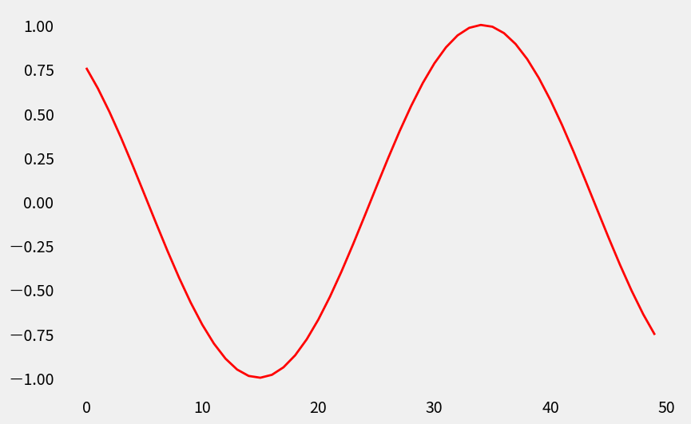

Here are other colors in `Color.available` :

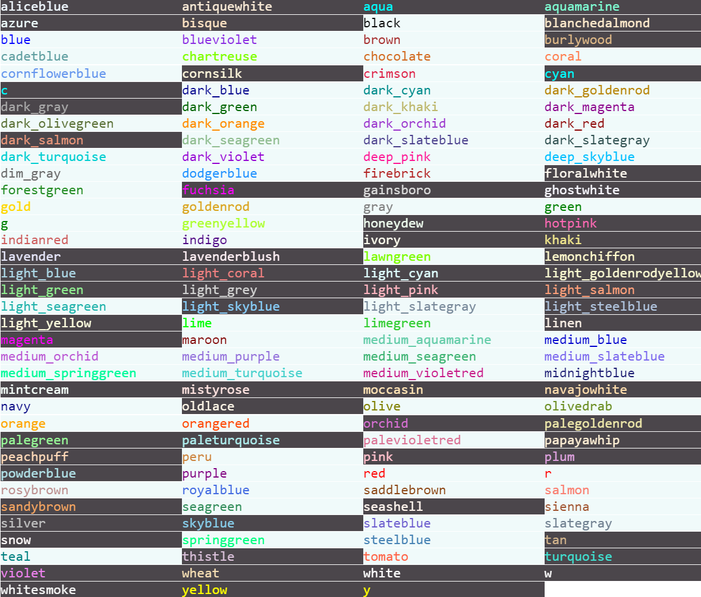
